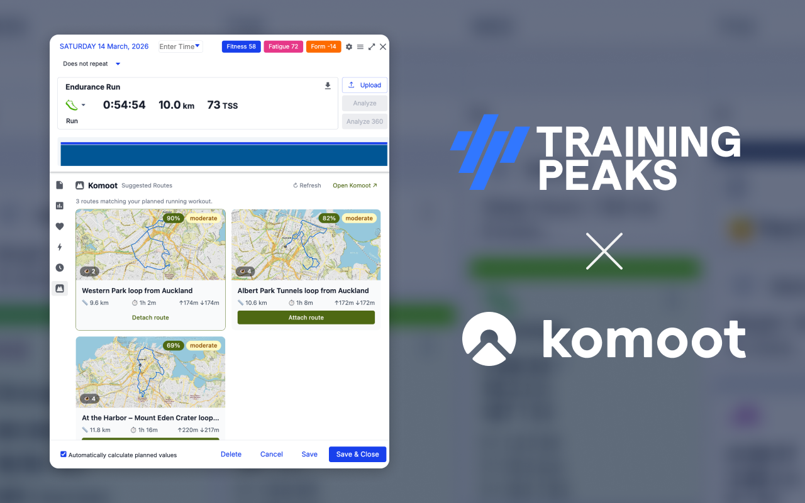
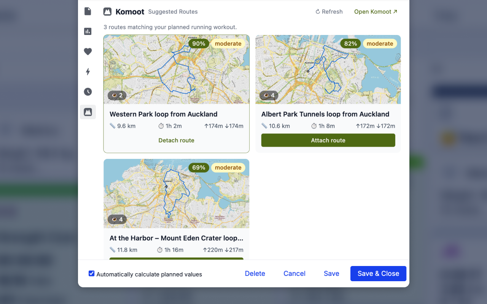
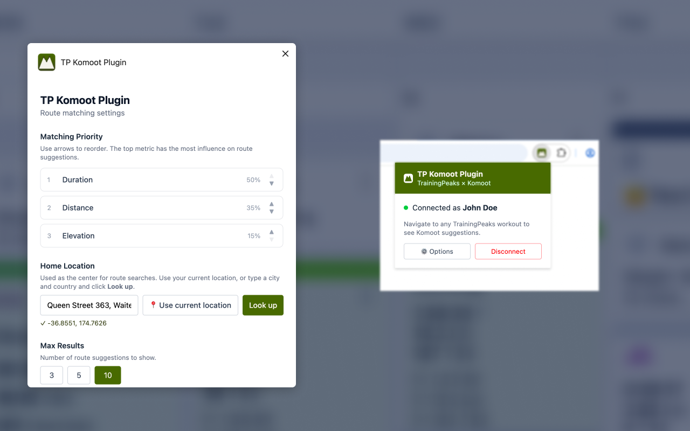

# TP Komoot Plugin

A browser extension for **Chrome** that adds a Komoot tab to the TrainingPeaks workout detail panel.

- **Planned workout** — suggests nearby Komoot routes ranked by how well they match your planned distance, duration, and elevation
- **Completed workout** — shows your Komoot activities from the same date

## Features

- Route suggestions ranked by match score with a per-metric breakdown on hover
- One-click attach/detach of a route to the workout description
- Elevation profile chart per route (collapsible)
- Home location search to centre results around where you train
- Configurable matching weights (distance · duration · elevation priority)
- Works in Chrome and Safari (Manifest V3)







## Installation

### Chrome

1. Run `npm run build` (see [Development](#development))
2. Open `chrome://extensions`, enable **Developer mode**
3. Click **Load unpacked** and select the `dist/` folder

### Safari (Experimental)

1. Install [Xcode](https://developer.apple.com/xcode/) and the Apple Developer tools
2. Run `npm run build:safari` — this converts `dist/` into a Safari Web Extension via `xcrun`
3. Open the generated Xcode project in `xcode-app/` and run it to install the extension
4. Enable the extension in **Safari → Settings → Extensions**

## Development

**Prerequisites:** Node.js 20+

```bash
npm install        # install dependencies
npm run dev        # watch mode — rebuilds on file changes
npm run build      # one-off production build → dist/
```

Load the `dist/` folder as an unpacked extension in Chrome (see Installation above) and reload it after each build.

TypeScript is checked before every build (`tsc -b`). The build will fail on type errors before Vite runs.

## Authentication

The extension uses your existing Komoot session. Sign in via the extension popup — it authenticates against Komoot's account API and stores your user ID locally. No credentials are ever sent anywhere other than Komoot's own servers.

TrainingPeaks workout updates (attach/detach route) use your active TrainingPeaks browser session — no separate login required.

## Permissions

| Permission                                              | Why                                                          |
| ------------------------------------------------------- | ------------------------------------------------------------ |
| `storage`                                               | Saves your Komoot session and extension settings             |
| `cookies`                                               | Reads the Komoot session cookie to authenticate API requests |
| `app.trainingpeaks.com`                                 | Injects the Komoot tab into the workout detail panel         |
| `tpapi.trainingpeaks.com`                               | Updates the workout description when attaching a route       |
| `account.komoot.com`, `www.komoot.com`, `api.komoot.de` | Komoot sign-in and route search                              |
| `nominatim.openstreetmap.org`                           | Resolves your home location from a place name to coordinates |

## Configuration

Open the extension options page (click the extension icon → Options) to configure:

- **Home location** — the centre point for route searches (city name or lat/lng)
- **Max results** — how many route suggestions to show (3, 5, or 10)
- **Matching weights** — how much distance, duration, and elevation each contribute to the match score

## Project structure

```
src/
  background/       Service worker: Komoot API client, auth, route scoring
  content/          Injected into TrainingPeaks: tab injector, workout parser
  ui/               React components: KomootTab, RouteCard, ActivityCard, ElevationChart
  popup/            Extension popup (sign in / sign out)
  options/          Options page
  types/            Shared TypeScript types
public/
  manifest.json     Manifest V3
  icons/            Extension icons
```

## Contributing

Pull requests are welcome. For significant changes please open an issue first to discuss the approach.

```bash
npm run lint       # ESLint
npm run build      # TypeScript check + build
```
